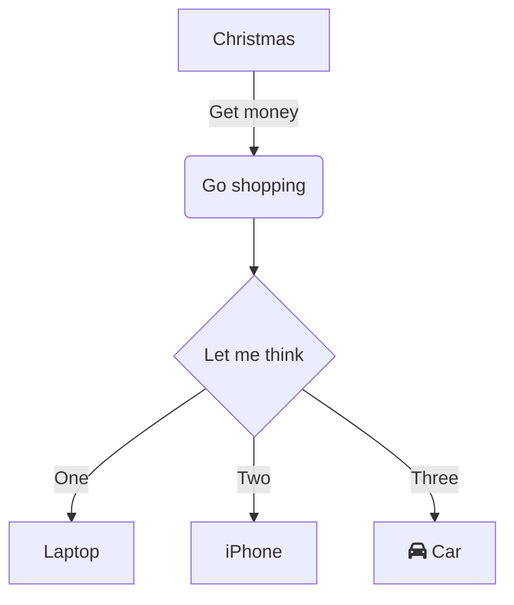

# FISI Übersicht

## Fächer

[[LF01 - Betrieb und sein Umfeld]]
[[LF02 - Arbeitsplätze nach Kundenwunsch]]
[[LF03 - Clients in Netzwerke einbinden]]
[[LF04 - Informationssicherheit]]
[[LF05 - Datenbank]]
[[LF05 - Programmieren]]
[[LF06 - Service Anfragen]]
[[LF07 - Cyber-physische Systeme ergänzen]]
[[LF08 - Anwendungsentwicklung]]
[[LF09 - Netzwerke und Dienste bereitstellen]]

