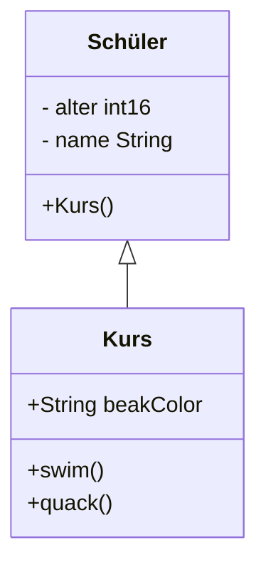

parent: [[FISI]]
Lehrer: Oeni, Abu, Hasj
Raum: A122, A122, C211

---
```dataview
list from [[LF08 - Anwendungsentwicklung]]
```
---
### ToDo
### Fertig
- Aufgabe ![[A_VB_Rennwagen_01.pdf]]

Diagramsoftware: https://app.diagrams.net/
Struktograme: http://www.struktogrammer.ch/JavaVersion/jstgr.html

![[Bildschirmfoto 2021-09-15 um 09.51.33.png]]

#### UML Notationsübersicht
![[UML-Notationsübersicht-2.5.pdf]]


## [[LF08 -- Einführung in die Objektorientierte Programmierung (OOP)]]


### Konstruktoren
![[I_Konstruktoren.pdf]]

Konstruktoren
- haben den gleichen Namen wie die Klasse
- hat keinen Rückgabewert, "void" ist nicht nötig

Konstrutor mit Übergabewert
```c#
public Person(string n, string m) 
{
	this.vorname = n;
	this.nachname = m;
}
```

![[A_Konstruktoren.pdf]]

Klassen haben:
- attribute 
- **methoden**
	- kann einen Rückgabewert haben
- **konstrukoren**, errstellt oder verändert daten
	- muss den gleichen Namen haben wie die Klasse
	- muss beim erzeugen aufgerufen werden, mit new
	- können keinen rückgabewert ausgeben

#### Instanzattribute
- ähnlich wie in python variablen

#### Klassenattribute
- static
- ist für die ganze klasse gleich

#### Instanzmethode
```c#
Drucke objFilm01.GetTitle()
```

### Aufgabe  Rennwagen
![[A_CSharp_RennwagenV1.pdf]]

### Eigenschaften
![[I_Eigenschaften.pdf]]

### Aufgabe Inventar
![[A_Lernsituation.pdf]]

### Beziehung zwischen Klassen

![[I_Assoziationen_01.pdf]]
![[A_Assoziationen_01.pdf]]


![[A_Assoziationen_04.pdf]]
#### Lösung:
![[A_Assoziationen_04.xlsx]]

![[I_SpezielleAssoziationen_01.pdf]]





### Klassen in c#
![[SwiftScan 07.10.2021 11.08.pdf]]


## Block 2


### Neuen Wert zu Objekt zuweisen

``` c#

objCisco.gebühr = 150; // neuen Wert zu Objekt zuweisen

Console.writeLn(objCisco.getinfo()); // Werte für das Objekt aufgeben
```


### Spezielle Assoziazionen

Komposition:
- Alle Teile ergeben ein gan zes
- können nicht ohne

Aggregation:
- mehrere Teile können auch ohne den Hauptteil existieren


### Vererbung
![[I_Vererbung_01.pdf]]
![[F_Vererbung_01.pdf]]
![[A_Vererbung_02.pdf]]

### UML: Klassendiagram aufgabe


![[Klassendiagramm_Auf.pdf]]![[Klassendiagramm_ML.pdf]]

### Prüfungsvorbereitung

![[A_IHK_S10_ZW_3_5.pdf]]

![[A_IHK_H11_ZW_3_9.pdf]]

![[A_IHK_H11_ZW_2_16.pdf]]

![[A_IHK_H11_ZW_2_15.pdf]]

![[A_IHK_F12_ZW_3_5.pdf]]

![[A_IHK_F12_ZW_2_3.pdf]]

![[A_IHK_F12_ZW_2_2.pdf]]

![[A_IHK_F13_ZW_3_5.pdf]]

![[A_IHK_F13_ZW_3_4.pdf]]

![[A_IHK_F13_ZW_2_9.pdf]]

![[A_IHK_F13_ZW_2_8.pdf]]

![[A_IHK_F13_ZW_2_7.pdf]]