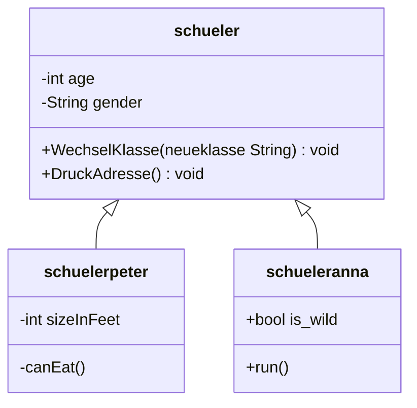

parent: [[LF08 - Anwendungsentwicklung]]
___

## Einstieg OOP
![[I_EinstiegOOP.pdf]]

### Präsentation Objekte und Klassen
![[F_ObjekteUndKlassen_01.pdf]]
Objekte haben Attribute/Entitäten
- Name
- Alter
- etc.

Objekt:
- Softwaretechnische repräsentation eines Gegenstandes
- Objekt hat Attribute
- Fähigkeiten(Methoden)

UMB Diagram:
- Bauplan/Schablone
- Objekte werden aus Instanzen erzeugt
- Objekte = Instanz

- Wechselklasse, benötigt einen **String** mit dem Namen der **neueklasse**
- DruckAdresse braucht keinen zusätztliche Daten

### Sichtbarkeit
Privat (-)
- Attribute sind üblicherweise privat

Public (+)
- Public-Elemente können für ein Objekt aufgerufen werden / angesprochen werden
- attribute sind nach außen geschützt
- sie besitzen in der Regel die Sichtbarkeit private.
- Von außen erfolgt der Zugriff auf Attribute nur über Methoden

### Variablennamen in C#
- Erlaubt alphanumerische Zeichen und Unterstrich, leerzeichen nicht erlaubt
- Nicht zulässig, sonderzeichen & leerzeichen
- Sondernamen wie zum beispiel class

## UML-Klassendiagramm
![[F_UML_01 1.pdf]]

### Umstieg von Python auf 
![[OOP4Phyton.pdf]]

Datentyp und Initialisierung
- Wenn Datentyp Undeklariert
- Um einen Wert auszugeben, muss eine Variable Deklariert und dediziert sein

Mengenklammer - macht die einrückung(python) überflüssig

![[UMLSichtbarkeit.pdf]]
### Überladung
- 
![[ueberladung_20200928_201400.pdf]]

## Basics in C#
![[I_BasicsCSharp.pdf]]
### Erste Klasse in C#
![[A_CSharpErsteKlasse.pdf]]

### Schueler Start.cs
![[B_Schueler_V1_Start.cs.pdf]]

## Praktisch starten

Projekt starten
- Konsolen app, netcore
- control + F5

### Aufgabe
![[A_VB_Rennwagen_01.pdf]]

